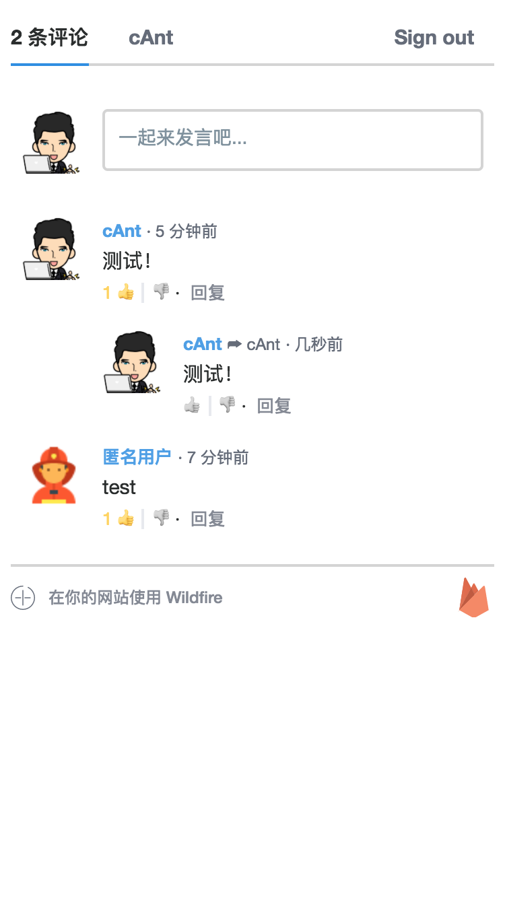

# Wildfire

<!-- 
 -->
  
  &emsp;=&emsp;
  
  &emsp;+&emsp;
  

A drop-in replacement for other comment systems.

> *"From a little spark may burst a flame".*
> 
> *—— Dante Alighieri, Paradiso*

## Screenshots

  
  

## Usage

1. CDN
    - `wildfire.auto.js`: 
        - [JSFiddle: Wildfire Example: CDN (wildfire.auto.js)](https://jsfiddle.net/CHENGKANG/trdgbeeo/)
        - [exmaple 4](https://github.com/cheng-kang/wildfire/tree/master/examples/4)
    - `wilddog/wildfire.min.js` (if you are using `Vue` in your project)
        - [JSFiddle: Wildfire Example: CDN (wilddog/wildfire.min.js)](https://jsfiddle.net/CHENGKANG/99q5oow4/)
    - `firebase/wildfire.min.js` (if you are using `Vue` in your project)
        - [JSFiddle: Wildfire Example: CDN (firebase/wildfire.min.js)](https://jsfiddle.net/CHENGKANG/zrm1g9s8/)
2. UMD
    - `wildfire.min.js`: 
        - [exmaple 3](https://github.com/cheng-kang/wildfire/tree/master/examples/3)

## Features

1. For site owners:
    - Database Support: 
      - [x] [`Firebase`](https://firebase.google.com/)
      - [x] [`Wilddog`](https://www.wilddog.com/).
    - Admin Function: 
      - [x] Delete comment
      - [x] Ban users by their IP/email

2. For all visitors (anonymous & authorized):
    - [x] Comment (with `Markdown` support)
    - [x] Mention (@username)
    
3. For authorized visitors:
    - [x] Like/dislike a comment
    - [x] Delete own comments
    - [x] Report inappropriate comments
    - Update user profile
      - [x] Display name
      - [x] Avatar
    - Personal Center:
      - [x] Notification

## License

[GNU General Public License v3.0](https://github.com/cheng-kang/wildfire/blob/master/LICENSE)
