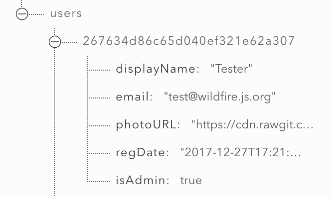

# Admin

`wildfire` provides site owners admin functions to help them better manage their comments. These features are only available to `admin user`s.

## Admin User

To grant a user admin privileges, you just set `users/${uid}/isAdmin` to `true` (*type: boolean*).

!> Make sure you set the node with a **boolean** value, string value will not work.

You can have as many admin users as you want. They share the same privileges.

## Admin Only Features

- Delete any comment
- Ban users by their IP/email
- [Reset discussion count of all pages](admin-helpers.md#_1-reset-discussion-count-for-all-pages)
- [Get discussion count](get-discussion-count.md)
- [Admin Helper Functions](admin-helpers.md)
